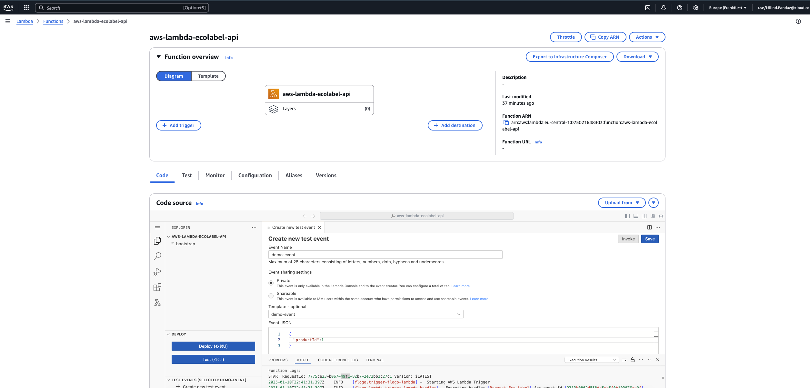
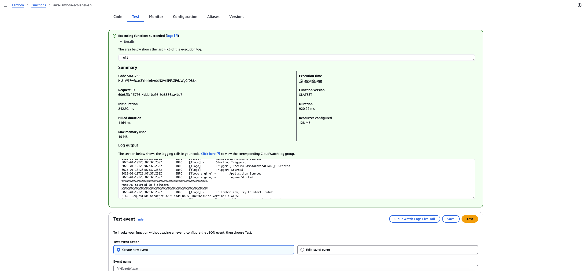

# Automating Flogo Deployments to AWS Lambda with Terraform
This repository demonstrates how to automate the deployment of Flogo applications to AWS Lambda using Terraform. By leveraging Infrastructure as Code (IaC) principles, you can streamline your serverless deployments, improve consistency, and reduce manual effort.

## What is TIBCO Flogo Enterprise?
 [TIBCO Flogo](https://www.tibco.com/content/dam/tibco/documents/data-sheet/tibco-flogo-enterprise.pdf) is an open-source ecosystem of tools and frameworks designed for building event-driven applications and functions.

 It's particularly well-suited for creating lightweight and efficient serverless functions and microservices

## Why Terraform?

[Terraform](https://www.terraform.io/) is an open-source IaC tool that allows you to define and manage your infrastructure in a declarative manner. It supports various cloud providers.

## What this repo does:

This repository provides a Terraform configuration that:

- **Creates** an IAM role for the Lambda function with the necessary permissions. 
- **Builds** a ZIP archive of your Flogo application code.
- **Creates an AWS Lambda function** and configures it to use the Flogo binary.

## Prerequisites

- **AWS Account**: An AWS account with appropriate permissions.
- **Terraform**: Terraform installed and configured on your local machine.
- **AWS CLI**: The AWS CLI installed and configured.
- **Flogo Application**: A Flogo application ready to be deployed.

## How to use

  1. **Clone the repository**:
  `git clone https://github.com/mpandav-tibco/flogo-lambda-terraform.git`

  2. **Build your Flogo app**:
  Build your Flogo application either using TIBCO Cloud UI, Platform APIs or Visual Code Extension, ensuring it's built for the correct target architecture (e.g., `linux` and `amd64` for AWS Lambda).

  1. **Configure Terraform**:
  Follow the steps outlined the main.tf (this is just for demonstration)

  1. **Run Terraform**:
- **Initialize Terraform**: `terraform init`
  - **Plan the changes**: `terraform plan -out ./terraform-plan.yaml`  //reuse the configuration
  - **Apply the changes**: ` terraform apply "./terraform-plan.yaml"`

## Customization
- **Environment variables**: You can add environment variables to your Lambda function configuration in the main.tf file.
- **IAM permissions**: Adjust the IAM role permissions as needed for your your deployment.

## Result
- **Flogo in AWS Lambda**
  
  

- **Testing using dummy event**
  
  